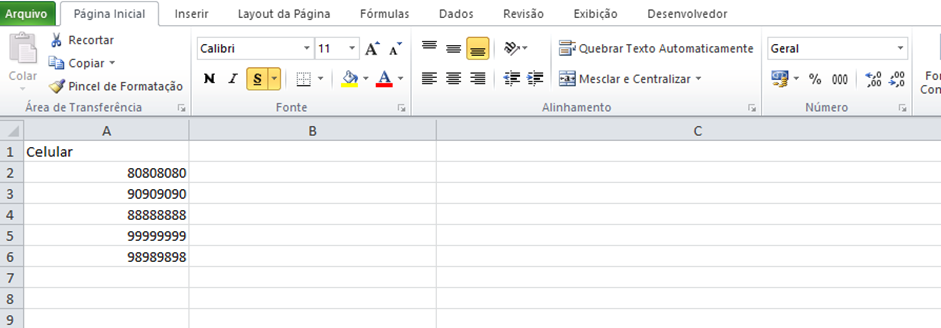
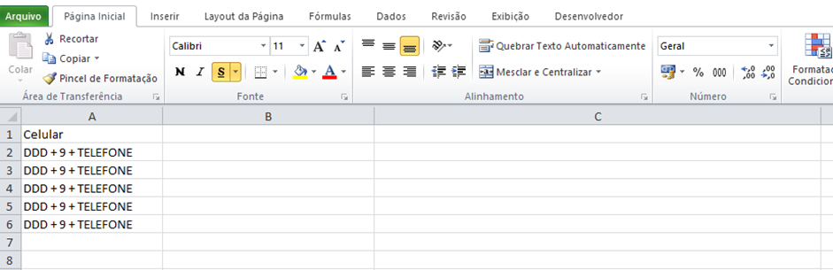
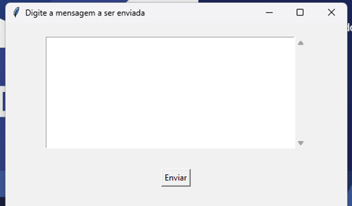
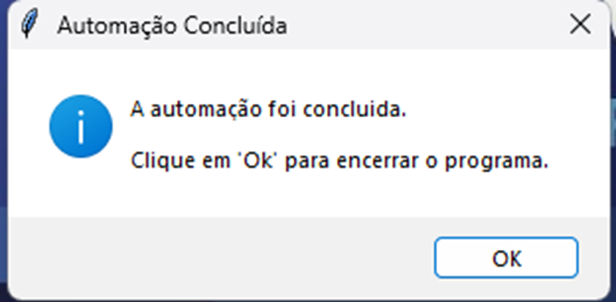

# AutoZap

**AutoZap** é uma automação web desenvolvida em Python para facilitar o envio de mensagens de texto ou arquivos em massa para uma lista de contatos previamente definida. Diferente da função de listas de transmissão do WhatsApp, o **AutoZap** permite o envio mesmo que o contato destinatário não tenha o número de origem salvo.

---

## 📋 Funcionalidades

- **Envio em Massa de Mensagens de Texto (AutoZap Text):**

  - Envia mensagens de texto personalizadas para cada número contido em uma planilha Excel.

- **Encaminhamento de Arquivos (AutoZap Arquivos):**
  - Encaminha arquivos ou mensagens anexadas a um grupo do WhatsApp para contatos contidos na planilha Excel, em lotes de 5 contatos por vez.

---

## ✅ Requisitos

Para utilizar o **AutoZap**, é necessário:

- **Planilha em Excel:** No formato adequado, contendo os contatos dos destinatários.
- **Navegador Chrome:** Deve estar instalado no computador.
- **Smartphone:** Para login no WhatsApp Web.
- **Grupo do WhatsApp:** Necessário para o envio de arquivos (mais detalhes abaixo).

---

## ⚙️ Configuração e Instalação

Para facilitar o uso por outros membros da equipe, o programa foi disponibilizado como executável. Siga as instruções abaixo:

### Passo a Passo de Uso

_O passo a passo a seguir se difere minimamente entre o AutoZap Arquivos e o AutoZap Textos, diferenças essas que serão destacadas a seguir_

1. **Preparar a Planilha de Contatos:**

   - Crie uma planilha no Excel com os contatos no formato específico:
     - **AutoZap - Arquivos:** Coluna "A" com os números **sem o DDD e sem o dígito 9 adicional** (ex.: `80808080`).
       Exemplo de como deve ficar:
       
     - **AutoZap - Texto:** Coluna "A" com os números **com DDD e o dígito 9** (ex.: `61980808080`).
       Exemplo de como deve ficar:
       
   - Certifique-se de que a primeira linha da coluna "A" contém o cabeçalho `Celular`.

2. **AutoZap - Arquivos:**

   - No WhatsApp do celular, crie um grupo chamado `Robô` (exatamente como está escrito) e envie a mensagem/arquivo que será encaminhado.
     - Exemplo de grupo, contendo o número que enviará as mensagens:
     

     
     

   - Exclua mensagens anteriores no grupo, deixando apenas a última que será enviada.

3. **Executar o Programa:**

   - Localize o executável (`AutoZap_arquivosV2.exe` ou `AutoZap_text.exe`).
   - Clique duas vezes para iniciar.
   - Selecione a planilha de contatos quando solicitado.
   - **Para o AutoZap Texto:** Após selecionar a planilha de contatos, aguarde a janela de texto aparecer, insira a mensagem que será enviada, siga os padrões de formatação do WhatsApp.
     - Imagem ilustrativa:
       

         
       

     - [Guia Oficial de formatação de mensagens WhatsApp](https://faq.whatsapp.com/539178204879377/?locale=pt_BR&cms_platform=web)
   - Faça login no WhatsApp Web escaneando o QR Code.
   - O envio será iniciado automaticamente.

4. **Finalizar:**
   - Ao final, o programa exibirá uma mensagem de conclusão (Minimize tanto o navegador Chrome quanto o terminal, caso tenha sido aberto). Verifique se todos os contatos receberam a mensagem.
     - Print da tela final:
     

       
     

---

## 🗂 Estrutura de Arquivos

O projeto contém os seguintes arquivos principais:

- `AutoZap_arquivosV2.py`: Automação para envio de arquivos.
- `autoZap_text.py`: Automação para envio de mensagens de texto.

---

## 🛠 Tecnologias Utilizadas

- **Python:** Linguagem principal para o desenvolvimento.
- **Bibliotecas:** Selenium, pandas, entre outras.
- **Navegador Chrome:** Para acesso ao WhatsApp Web.

---

## 📝 Licença

Este projeto está sob a **Licença de Uso Restrito**. O uso comercial é proibido sem autorização prévia. Consulte o arquivo [LICENSE](./LICENSE) para mais detalhes.

---

## 🤝 Contribuições

Contribuições são bem-vindas! Para sugestões ou melhorias, sinta-se à vontade para abrir uma _issue_ ou enviar um _pull request_.

---

## 📞 Contato

Dúvidas ou solicitações podem ser enviadas para:  
**Erick Cezar**  
erickcezar07@gmail.com

---
